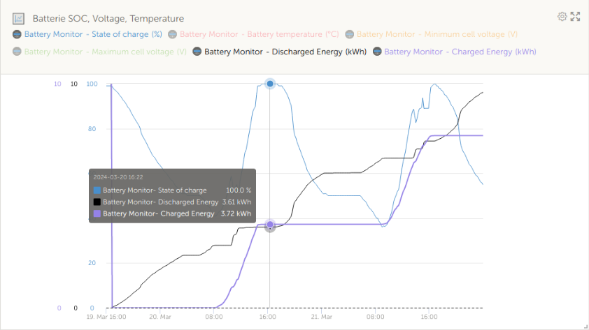

# Battery-energy-meter

Disclaimer : as usual, you shall understand the script before using it, and you are the only responsible if problems occurs using it.

Charged and discharged energy processing script for pylontech battery used with victron CerboGX / VenusOS 
The script is designed to run on a Victron CerboGX or Rpi with VenusOS

Its aim is to calculate /History/DischargedEnergy and /History/ChargedEnergy dbus value for battery bms which doesn't provide them. The dbus com.victronenergy.battery.xxxx /Dc/0/power is integrated every second to get them.

The result is injected on the dbus and then available in VRM

Discharged and Charged energy indexes are intialized with json file (/data/battery-energy-meter/energy.json or in case of service instalation, /data/battery-energy-meter/service/energy.json) on launching.
Discharged and Charged energy indexes are saved in same json file when process is exited with SIGTERM or SIGINT signal.

Take care , that in case of mistake, especially if you modify the energy.json file manually during a period where the script is stopped. Some wrong value could be send to VRM which can impact statistics and reports displayed in VRM. Positive jumps on energy indexes can be understand by VRM as real charged ans discharged energy. Negative jumps seem not to be taken in accountand processed as erroneous data.

## Script installation

You need at least basic knowledge in linux command tool.
You need to have ssh and sftp access to your CerboGX. The way to do it is explained [here](https://www.victronenergy.com/live/ccgx:root_access).
Then log with ssh, create a battery-energy-meter in /data and a battery-energy-meter in /var/log
'''
mkdir /data/battery-energy-meter
mkdir /var/log/battery-energy-meter
'''
Then, with sftp, copy content of this repository src directory into /data/battery-energy-meter

## To launch the script into a terminal
```
cd /data/battery-energy-meter
python battery-energy-meter.py
```
and then you can display logs in real time in another terminal with
```
tail -f /var/log/battery-energy-meter
```
Use Ctrl-C to stop the script

## To have the script running in background, even after terminal logout
```
cd /data/battery-energy-meter
nohup python battery-energy-meter.py&
```

To kill the script :
```
pkill -f "python battery-energy-meter.py"
```

## To have the script running in background even after a reboot or a firmware update

Add the line "ln -s /data/battery-energy-meter/service /service/battery-energy-meter" to the /data/rc.local file and reboot the CerboGX

After that you can use [svc command](https://cr.yp.to/daemontools/svc.html) to control the service

To stop the service with indexes backup :
```
svc -d /service/battery-energy-meter
```
To stop the service without indexes backup :
```
svc -k /service/battery-energy-meter
```
To start the service :
```
svc -u /service/battery-energy-meter
```

## To reset indexes to 0 (for exemple when SOC is 100% to have a clean start point)
Stop the service

Clear the energy.json file

Start the service
```
svc -d /service/battery-energy-meter
rm /data/battery-energy-meter/service/energy.json
svc -u /service/battery-energy-meter
```


## VRM result

You can now display charged (curve purple) and discharged ( curve black) in VRM. Indexes have been set to zero when SOC is 100 %


So you can check that after one discherged/charged cycle (one Pylontech US5000 battery), discharged energy is 3.61 kWh, charged energy is 3.72 kWh which allow to calculate an efficiency of 97%.
